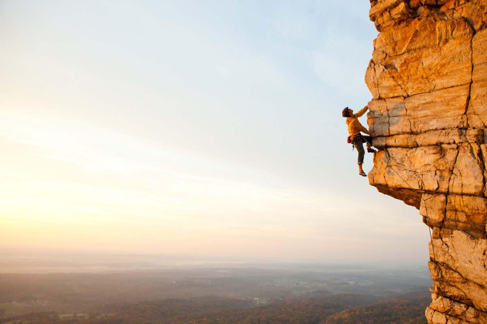

# Between calm and passion

이 기록장은 정보에 대한 마음이 해이해 지는 것을 경계하고 지난 날들을 돌아보고자 만들었습니다.

## 사용방법
 * steps : 가까이서 파고들어 생각해 볼 문제들을 올려놓는 곳
 * holds : 올라가기 위해 짚고 갈만한 문제들

## 정보꿈나무의 발자취
 * 12/21~28[예정]
   * [최소값 찾기][min]
   * [일곱 난쟁이][2309]
   * [비슷한 단어][2607]
   * [줄세우기(방법 1만)][2605]

## 선생님의 발자취
 * 12/21
   * [min], [2309], [2607], [2605], [2587]

## 선생님이 만들어야 할것들(어서 일해라!)

[//]: # (Reference)

